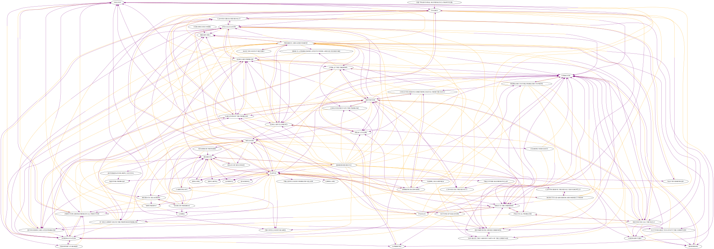

# Parse Polya

Parse the heuristics dictionary of "How To Solve It" by G. Polya in a DiGraph. Mostly intended for personal understanding.

## DiGraph

## Tree

Tree specifically generated for 'Understanding The Problem':

